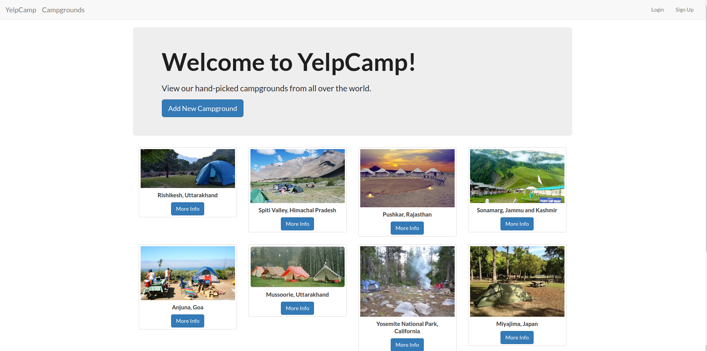
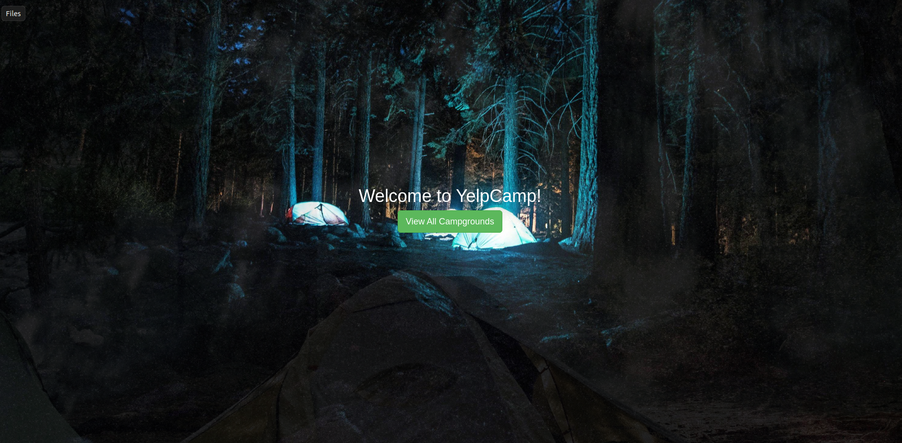
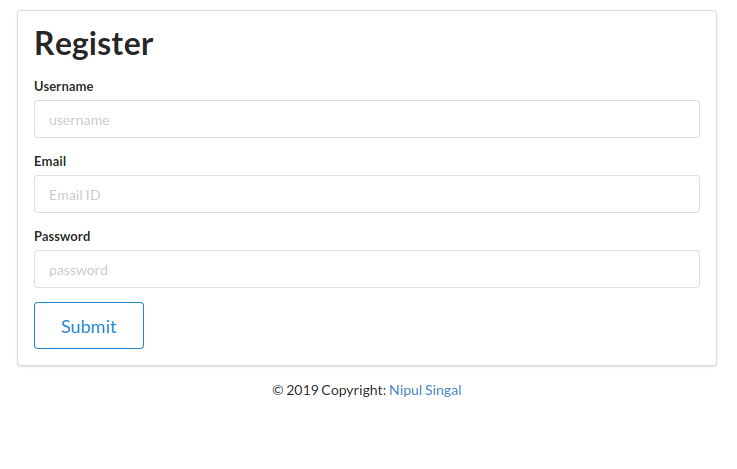
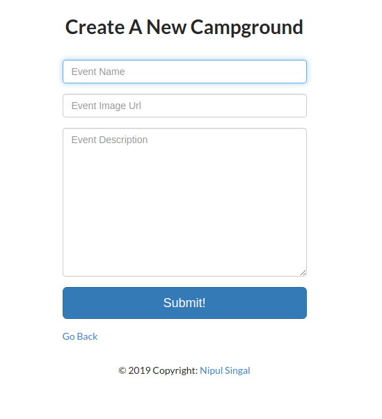
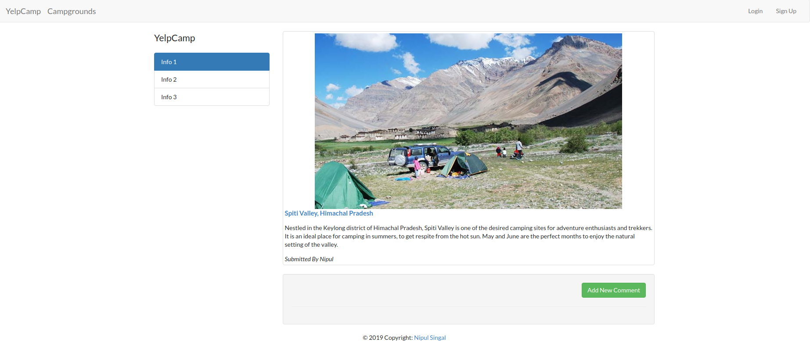

<h1 align="center">YelpCamp - A Camping Website</h1>

<h2 align="center"><a  href="https://yelp-camp-0.herokuapp.com">Visit the Site</a></h2>

## Setup -

> This project is made using **Node.js, MongoDB and .ejs**. So make sure you have **Node** installed before deploying it locally.

## Glimpses

## Welcome Screen 👓

## Register Section 👓

## Add New Campground Section 👓

## Campground Details Screen 👓

> Copyright to NipulSingal. Credits to Colt Stele...
